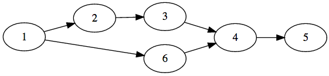

Rally 解説
----

author: *snuke*

まず、削除すると最長経路の長さを減らすような頂点があるかどうかを判定してみましょう。

最長経路の長さを減らすために削除すると良い頂点は、現在の最長経路に含まれているような頂点です。

とりあえず最長経路に含まれている頂点だけを残したグラフを作ります。

そのような頂点を判定する方法ですが、

- 頂点vを始点とした経路のうち最長のものの長さ（= dist_f[v]とする）
- 頂点vを終点とした経路のうち最長のものの長さ（= dist_e[v]とする）

を適当なDP等で求めておけば、

- dist_f[v] + dist_e[v] == 現在の最長経路の長さ

を満たすような頂点が、最長経路に含まれる頂点であることがわかります。

で、出て来たグラフがこんな感じだったとします。

で、これを dist_f[v] ごとにレイヤ分けして並べます。

すると、どの頂点を削除すればいいかは一目瞭然です。

同じレイヤに１つしか頂点がないような頂点を消せばいいです。

---

さて、次は頂点を１つ削除して「長さが L 以上の経路」がないようにできるかを判定しましょう。 
（これさえできれば後は二分探索と解の復元を適当にやるだけです。）

とりあえず「長さが L 以上の経路」に含まれる頂点だけを残したグラフを作ります。

そういう頂点の条件は、

- dist_f[v] + dist_e[v] >= L

ですね。

あと、「長さが L 以上の経路」に含まれない辺も無視します。（頂点の時と同様に判定できる）

L = 3 として、出てきたグラフがこんな感じだったとします。（今度は初めからdist_f[v]でレイヤ分け済み）

このグラフだと、4 を消せば良いです。

消すと良い頂点の条件を考えてみます。

1. 同じレイヤに複数個の頂点があってはダメ（3,6 はこの条件によりダメ）
2. レイヤをまたぐような辺があってはダメ（2 はこの条件によりダメ）
3. 「現在の最長経路の長さ」- L <= dist_f[v] <= L じゃないとダメ（1,5 はこの条件によりダメ）

これらを全て回避するような頂点があればそれを削除すれば良いです。

この条件が必要十分であることを確かめてみると良いでしょう。

条件1,3は簡単に判定でき、条件2はimos法とかを使えば簡単です。

